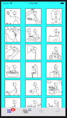
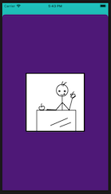

## Dede

DeDe is a wordless collection of images for small children. The images feature simple stickman drawings depicting various activities. It stimulates the children's imagination and vocabulary as it inspires them to create their own story and talk about it.

The first view you are brought to after launching the application is the landing page with the application logo.

Click on the red button to navigate to various views of the images.
Click on the Amazon logo button to view the images offered as a printed papercover book offered on the Amazon.

### Navigation

#### Tiles view

The first view inside of application is the tiles view. You can also navigate here by clickin the tile view icon:

All the images are offered as mid-sized tiles. Scroll up and down to see the full list:

Click on any tile to preview it individually. The color of the background of the tile is generated randomly:

Click on it again to dismiss it and return back to the full tile list.

#### Slide view

The application offers another type of view, the slide view. Navigate here by clicking the slide view icon:

In this view all images are presented individually on the screen and you can navigate to the next one or to the previous one with a slide gesture. The color of the background in this view is also generated randomly:

When you reach the end of the list, the list is regenerated to allow you to continue sliding forward. The order of items is randomized.

#### Mute and unmute

In both the tile view as well as the slide view interaction with the images is accompanied with a short tink sound and device vibration. You can mute and unmute this behaviour with the sound button. Navigate to the view with the button by clicking the sound button icon:

After you navigate to the sound button view, tap the sound button to mute and unmute the sound and the vibrations:

 >>>>> 

#### Return

You can always return to the landing page by clicking on the return button:

This allows you to restart your flow or select the Amazon icon to view purchasing options for the printed paperback book or kindle offering with the images.

### Printed hard-copy

Navigate to the Amazon offering by clicking the Amazon logo button:

This will open the browser or the Amazon application on your device:

[here](https://www.amazon.com/dp/B08F6TVYR2).

### The Copyright

[The Copyright Act (USA)](https://en.wikipedia.org/wiki/Copyright_law_of_the_United_States).
[The Copyright Act (EU)](https://en.wikipedia.org/wiki/Copyright_law_of_the_European_Union).

## Demo

[] (./DeDeDemo.mov)

## Support

For any kind of feedback use `dede <dot> book <dot> katarina <dot> lukacsy <at> gmail <dot> com` email address.

